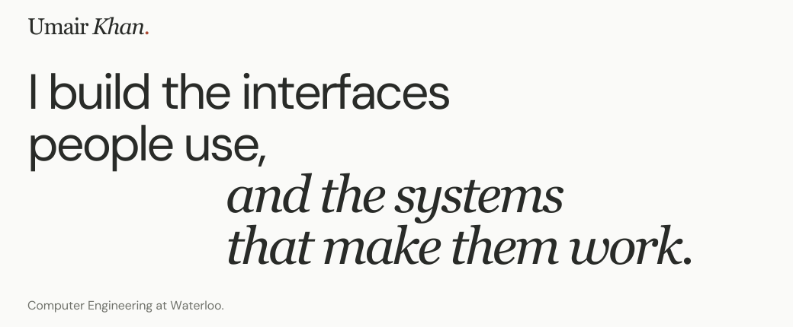

<picture>
  <source media="(prefers-color-scheme: dark) and (max-width: 600px)" srcset="./assets/header-mobile-dark.svg">
  <source media="(max-width: 600px)" srcset="./assets/header-mobile.svg">
  <source media="(prefers-color-scheme: dark)" srcset="./assets/header-dark.svg">
  
</picture>

[Website](https://umair-khan.vercel.app/) &nbsp; · &nbsp; [Resume](https://umair-khan.vercel.app/umair-khan-resume.pdf?v=2026-09-17) &nbsp; · &nbsp; [LinkedIn](https://www.linkedin.com/in/umair-khan0/) &nbsp; · &nbsp; [Email](mailto:u7khan@uwaterloo.ca)

I'm a **Computer Engineering student at the University of Waterloo**, graduating in April 2028. I like building software and getting involved in the decisions around it: what we should build, how it should fit together, and where we can save ourselves unnecessary work.

## Experience

<!-- EXPERIENCE: Keep each role concise; longer project notes live on the website. -->
**Miovision · Software Developer Intern** 
Jan–Apr 2026

Led Tuba integration across frontend and device teams, enabling Miovision adoption at 40% lower hardware costs. Drove the new Device Manager experience with design and engineering, and built NestJS/RxJS provisioning flows that cut device registration time by 25%. Worked across camera configuration, hardware constraints, and compatibility with legacy integrations.

**Eventist · Full-Stack Developer Intern** 
May–Aug 2025

Event and studio management tools: guest emails, scheduling, embedded storefronts, and payment integrations.

**Qoherent · Software Development Intern, two terms** 
Jan–Apr 2024 &amp; Sep–Dec 2024

Led full-stack development of the RIA Hub MVP, an AI development platform for software radios. Chose Gitea as the foundation for Git-like functionality so we could focus on our proprietary radio intelligence tooling. Worked across Vue 3, Go, FastAPI, dataset curation, Git LFS, and Google Cloud deployment.

Earlier work · Minds On &amp; Prosthetix

 

**Minds On · Web Developer · Jul–Aug 2023** 
Built homepage interactions, program pages, and contact workflows with JavaScript and Velo.

**Prosthetix · Full-Stack Software Developer · Jan–Apr 2023** 
Built an Astro interface and integrated contact forms. [View the code](https://github.com/UmairK5669/prosthetix).

## Projects

**[Lumous](https://lumous.app)** 
A macOS/Windows desktop automation app with device-bound licenses, Stripe payment processing, and automated signing and notarization. Reached **30+ customers in its first seven days**. 
FastAPI · PostgreSQL · Stripe · GitHub Actions · Azure Artifact Signing · Heroku · Cloudflare 
[Project notes](https://umair-khan.vercel.app/#work-lumous)

**[MuslimOS](https://muslimos.co/) + [Azan Box](https://muslimos.co/azan-box)** 
A prayer-time and Quran app and a companion smart speaker. The app provisions the speaker over Bluetooth, then the speaker plays calls to prayer autonomously at times calculated daily for the user's location and settings. 
React Native · ESP32 · Firebase Cloud Functions · Firestore · Firebase Cloud Messaging 
[Project notes](https://umair-khan.vercel.app/#work-muslimos)

## Tools I work with

**Interfaces** · TypeScript, JavaScript, React, React Native, Next.js, Vue 3, Angular, HTML/CSS, Tailwind CSS 
**Backend & APIs** · Python, Go, Java, FastAPI, Flask, NestJS, RxJS, Stripe 
**Data & cloud** · PostgreSQL, MongoDB, Firebase, AWS, Google Cloud, Cloudflare 
**Deployment** · Docker, Kubernetes, Nginx, GitHub Actions (CI/CD) 
**Testing** · Vitest, Cypress

---

Have something interesting to build? [Let's talk](mailto:u7khan@uwaterloo.ca). 
Developer. Gamer. Always learning what makes things work.
