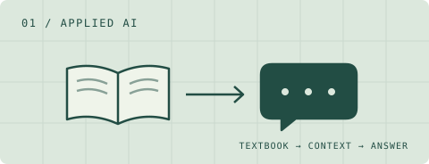
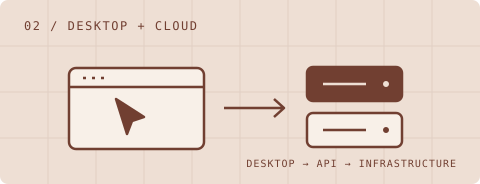

<picture>
  <source media="(max-width: 600px)" srcset="./assets/header-mobile.svg">
  
</picture>

  <a href="https://umair-khan.vercel.app/"><strong>Portfolio&nbsp;↗</strong></a> &nbsp; / &nbsp;
  <a href="https://drive.google.com/file/d/1K72FI06CSdbZkpYYNckgwkCfrwh5MyOG/view"><strong>Resume&nbsp;↗</strong></a> &nbsp; / &nbsp;
  <a href="https://www.linkedin.com/in/umair-khan0/"><strong>LinkedIn&nbsp;↗</strong></a> &nbsp; / &nbsp;
  <a href="mailto:u7khan@uwaterloo.ca"><strong>Say&nbsp;hello&nbsp;↗</strong></a>

I'm a **Computer Engineering student at the University of Waterloo** building web products, developer tools, and AI applications. I like working across the whole system, from the interface people use to the services behind it.

## 01 / Selected builds

<!-- PROJECTS: Keep these cards short. Add future projects by copying a card or swapping a featured build. -->
<table>
<tr>
<td width="50%" valign="top">

<h3>EngineerlyAI</h3>

<strong>A tutor that knows your course material.</strong>

Course-specific engineering Q&amp;A using Gemini and textbook context, with a Next.js chat interface and a Flask backend on Cloud Run.

<code>Next.js</code> <code>Python</code> <code>Gemini</code> <code>GCP</code>

<a href="https://github.com/UmairK5669/EngineerlyAI"><strong>Explore the code ↗</strong></a>

</td>
<td width="50%" valign="top">

<h3>CursorFlow</h3>

<strong>A desktop tool, built end to end.</strong>

Cross-platform activity automation with a packaged desktop app, FastAPI services, Stripe subscriptions, and automated license delivery.

<code>Python</code> <code>FastAPI</code> <code>Stripe</code> <code>GCP</code>

<a href="https://drive.google.com/file/d/1K72FI06CSdbZkpYYNckgwkCfrwh5MyOG/view"><strong>Read the project background ↗</strong></a>

</td>
</tr>
</table>

**Also in the workshop:** [Airbnb-style booking platform](https://github.com/UmairK5669/AirbnbClone) — listings, reservations, search, and authentication with Next.js and MongoDB.

## 02 / Where I've contributed

<!-- EXPERIENCE: Based on the existing resume. Add the next role here when its content is ready. -->
**Eventist · Full-Stack Developer Intern** 
May–Aug 2025

Event and studio management tools: guest emails, scheduling, embedded storefronts, and payment integrations.

**Qoherent · Software Development Intern, two terms** 
Jan–Apr 2024 &amp; Sep–Dec 2024

RIA Hub, an AI development platform for software radios. Worked across Vue, Go, FastAPI, Git LFS, and cloud deployment.

<strong>Earlier chapters → Minds On &amp; Prosthetix</strong>

 

**Minds On · Web Developer · Jul–Aug 2023** 
Built homepage interactions, program pages, and contact workflows with JavaScript and Velo.

**Prosthetix · Full-Stack Software Developer · Jan–Apr 2023** 
Built an Astro interface and integrated contact forms. [View the code ↗](https://github.com/UmairK5669/prosthetix)

## 03 / My toolkit

**Interfaces** &nbsp; `TypeScript` `JavaScript` `React` `Next.js` `Vue` `Tailwind CSS` 
**Services** &nbsp; `Python` `Go` `Java` `FastAPI` `Flask` 
**Data & delivery** &nbsp; `PostgreSQL` `MongoDB` `Firebase` `Google Cloud` `Docker` `Nginx`

---

**Have something interesting to build?** [Let's talk ↗](mailto:u7khan@uwaterloo.ca) 
Developer. Gamer. Always learning what makes things work.
